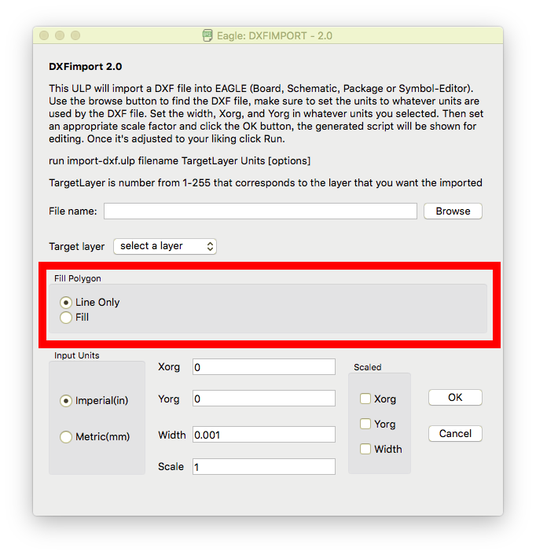

# import-dxf-polygonfills
EAGLE ULP for importing vector graphics - with "Import polylines as" option

## Usage

1. Load `import-dxf-polygonfills.ulp`  to Eagle, then you will find "Import polylines as" option in the middle.
2. Choose "Polygon" to import all polylines as polygons in dxf.
   * If you choose "Polyline", the script behaves completely same as original.

### Outputs

Imported polygons after ratsnest

## Note

I do not guarantee the results. Polygons with arcs and command line mode haven't been tested yet.

## License

MIT License

Original script 'import-dxf.ulp' was derived from EAGLE 8.3.2.

Modification applied by Onishy.
